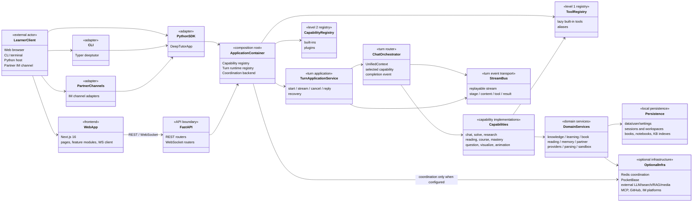
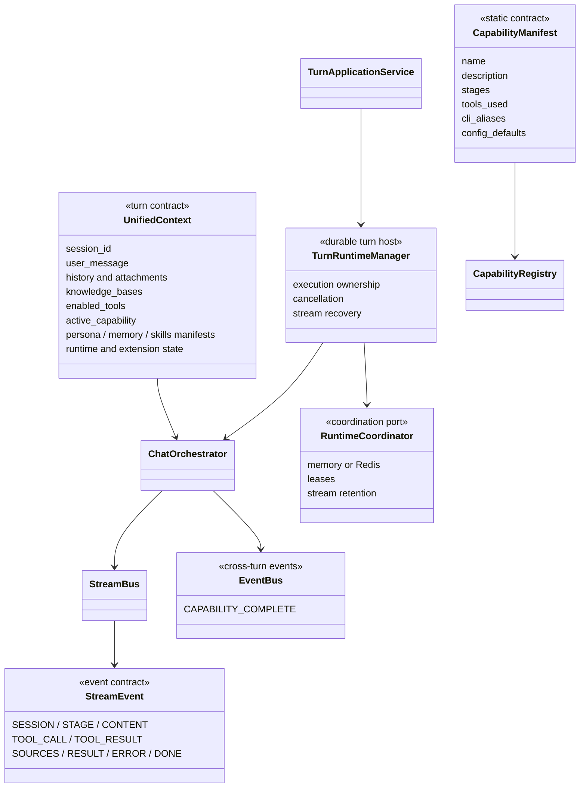
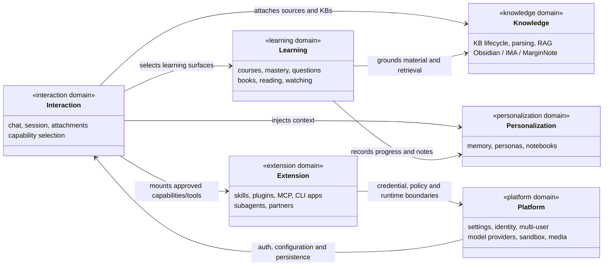

# DeepTutor 完整系统架构

> 本页是静态组件架构图：节点表示长期存在的边界、组件和依赖，连线表示调用/依赖关系；它不表达一次请求的时间顺序。

## 1. 系统边界与组件关系

## 2. 核心运行时边界

`UnifiedContext` 是所有 Capability 与工具的共同输入边界。它把会话、选中的能力、知识库、附件、可用工具、语言、Persona、Memory 和本轮私有运行时状态聚合在一起；新的可变扩展状态应使用 `extension_state` 命名空间，而不是滥用兼容性 `metadata`。

`ApplicationContainer` 是服务端/SDK 共用的 composition root。它创建 CapabilityRegistry、TurnEngine、按用户 scope 缓存的 TurnRuntimeManager 和协调后端。单机默认使用内存协调器；部署配置为 Redis 时才依赖 Redis。该选择使恢复、租约和流重放不属于 API router 或前端职责。

## 3. 产品域与代码所有权

| 边界 | 主代码位置 | 对外适配层 |
| --- | --- | --- |
| 交互与回合 | `deeptutor/runtime/`、`deeptutor/services/session/` | `unified_ws.py`、sessions router、CLI、SDK |
| Capability/Tool | `deeptutor/capabilities/`、`deeptutor/agents/`、`deeptutor/tools/` | capability/tool registry |
| 学习内容 | `deeptutor/learning/`、`book/`、`reading/`、`video_learning/` | courses、book、reading、video routers |
| 知识与检索 | `deeptutor/knowledge/`、`services/rag/`、`services/parsing/` | knowledge router、RAG tools |
| 个性化 | `services/memory/`、`services/notebook/`、`services/persona/` | memory、notebook、personas routers |
| 可扩展与协作 | `plugins/`、`services/mcp/`、`services/skill/`、`partners/`、`services/subagent/` | skills、MCP、partners、subagents routers |
| 平台服务 | `services/config/`、`services/llm/`、`multi_user/`、`services/sandbox/` | settings、auth、system、voice routers |

## 4. 部署与数据归属

| 资产 | 归属 | 默认位置/实现 | 注意事项 |
| --- | --- | --- | --- |
| 运行时配置 | 本地工作区 | `data/user/settings/*.json` | 由 runtime settings 服务读写；配置可经环境变量覆盖。 |
| 会话、学习状态与内容资产 | 用户 scope | session/learning/book/reading/notebook 服务 | 多用户模式下必须由认证后的用户 scope 解析，不由前端传入路径决定。 |
| 单轮事件 | 轮次运行时 | `StreamBus`、`TurnRuntimeManager` | 可重放范围受协调后端和 stream retention 配置影响。 |
| 索引与解析产物 | 知识库工作区 | knowledge、RAG、parsing 服务 | 解析/索引引擎可替换，不能假定某一引擎始终可用。 |
| 凭据 | 配置/凭据存储 | providers、MCP、OAuth、integrations 设置 | 禁止写入文档、技能包或前端配置。 |

## 5. 不变量与扩展规则

- API、CLI 与 Python SDK 都应通过应用容器和 TurnApplicationService 进入同一轮次运行时，避免为同一 scope 另建会话/流状态。
- Capability 是“接管一轮”的 Level 2 扩展；Tool 是由 Capability/Agent Loop 按需选择的 Level 1 函数。不要用 Tool 模拟独立多阶段产品面。
- Capability manifest 是可审计的静态契约。服务启动时 `validate_tool_consistency()` 会检查 manifest 声明的工具是否已在 ToolRegistry 中注册。
- 任何 capability 的终态必须通过共享完成语义发布；异常由编排器标准化为 `ERROR` 和 `DONE` 事件。
- WebSocket 路由在连接内部鉴权；普通 HTTP 路由通过学习面/管理员依赖控制。两者的权限实现位置不同，但同样不可由客户端声明绕过。

## 6. 相关功能说明

完整产品域说明见 [功能覆盖矩阵](../features/README.md)。
